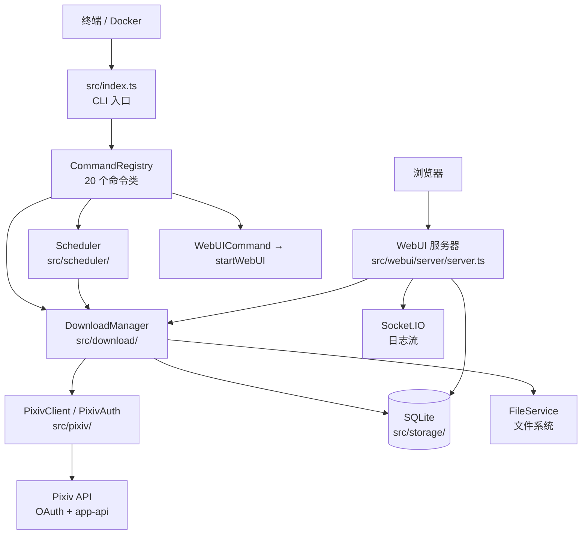

# PixivFlow 架构文档

> **English:** This document describes how PixivFlow is structured and how its runtime pieces cooperate. It covers the CLI entry point and command registry, the download pipeline (search/ranking to deduplicated files), the cron scheduler lifecycle, the SQLite storage layer, the WebUI server (Express + Socket.IO), the configuration loading chain, and Pixiv authentication. It is written for contributors who need to locate code and extend it. For day-to-day usage and the HTTP API reference, see the linked documents at the end.

本文档面向 PixivFlow 的贡献者,目标是回答三个问题:代码在哪里、数据如何流动、如何安全地扩展。命令行日常操作见 `USAGE.md`,HTTP 接口清单见 `API.md`。文中所有行为均以当前 `src/` 源码为准,并标注了关键文件路径。

## 总体架构



分层职责:

| 层 | 目录 | 职责 |
| --- | --- | --- |
| 入口层 | `src/index.ts`、`src/cli/` | 解析参数、路由到命令、组装 `CommandContext` |
| 命令层 | `src/commands/` | 20 个命令类 + 注册表,每个命令只做编排 |
| 业务层 | `src/download/`、`src/scheduler/` | 下载管线、并发控制、定时调度 |
| 数据访问层 | `src/storage/`、`src/download/FileService.ts` | SQLite 仓储、文件落盘与整理 |
| 外部集成层 | `src/pixiv/`、`src/terminal-login/` 等适配器 | OAuth 令牌、Pixiv API、浏览器登录 |
| 服务层 | `src/webui/` | REST API、Socket.IO 日志流、静态托管 |
| 横切层 | `src/config/`、`src/logger.ts`、`src/di/`、`src/utils/` | 配置加载链、日志、轻量 DI 容器、工具 |

## 模块地图

| 目录 | 内容 | 说明 |
| --- | --- | --- |
| `src/index.ts` | `bootstrap()` | 注册命令 → 解析参数 → 加载配置 → 执行或走默认行为 |
| `src/cli/` | `ArgumentParser`、`InteractivePrompt` | 参数解析;抛出 `VersionRequest`/`HelpRequest` 特殊错误 |
| `src/commands/` | `CommandRegistry`、`BaseCommand`、20 个命令 | 注册、别名、分类元数据、参数校验、错误建议 |
| `src/config/` | `defaults`、`environment`、`loader`、`validation`、`placeholders`、`path-resolution` | 配置类型、默认值、加载链、环境变量覆盖 |
| `src/di/` | `Container` | 极简 DI 容器(实例/工厂/单例三种注册方式);CLI 主路径目前是手工组装依赖,容器是可选基础设施 |
| `src/download/` | `DownloadManager`、`plan/`、`pipeline/`、`exec/`、`handlers/`、`recovery/`、`report/`、两个 Downloader、`FileService`、`FileNormalizationService` | 下载编排:计划 → 执行 → 落盘 → 记录 → 恢复 |
| `src/scheduler/` | `Scheduler` | node-cron 封装,带并发互斥、次数/失败上限、超时记录 |
| `src/storage/` | `Database`、`DatabaseMigration`、`repositories/` | better-sqlite3 访问,按领域拆分仓储(facade 模式) |
| `src/pixiv/` | `AuthClient`(即 `PixivAuth`)、`PixivClient`、`client/` 服务 | OAuth 刷新、检索/详情/媒体下载服务 |
| `src/terminal-login/`、`src/puppeteer-login-adapter/`、`src/python-login-adapter/`、`src/pixiv-token-getter-adapter.ts` | 登录适配器 | 三级降级链:pixiv-token-getter → Puppeteer(PKCE) → Python gppt |
| `src/webui/` | `server/`、`routes/`、`routes/handlers/`、`websocket/`、`services/` | Express 服务器、REST 路由与处理器、Socket.IO 日志流、下载任务管理 |
| `src/interfaces/` | `IDatabase`、`IDownloadManager`、`IFileService`、`IPixivAuth`、`IPixivClient` | 模块间契约,便于测试替换 |
| `src/utils/` | token、config-manager、concurrency、errors、date 等 | 令牌统一存储、配置读写修复、并发池、错误类型 |

## 命令注册与执行流程

`CommandRegistry`(`src/commands/CommandRegistry.ts`)是单个 `Map<string, Command>`:

1. `register(command)` 同时登记主名称与所有 `aliases`,别名冲突直接抛错。
2. `find(nameOrAlias)` / `get()` 按 key 查找;`getSuggestions()` 为输错的命令生成编辑距离建议。
3. `getCommandsByCategory()` 依据命令 `metadata.category` 分组,`help` 输出按此组织。

`src/index.ts` 的 `bootstrap()` 流程:

```text
ArgumentParser.parse(argv)
  ├─ VersionRequest / HelpRequest → 直接执行 VersionCommand / HelpCommand
  └─ 得到 { command, options, positional }
       ↓
RefreshCommand.preExecute()(仅 refresh 命令有此静态钩子)
       ↓
loadConfig(configPath, skipValidation)
  · skipValidation = 登录命令 或 "令牌可选命令" 集合 或 未指定命令
       ↓
executeCommand():command.validate?(args) → command.execute(context, args)
  · 失败 → logger.error + process.exit(1)
  · metadata.longRunning 为 true 的命令(webui、scheduler)不调用 process.exit(0),进程保持存活
```

未指定命令时的默认行为(`executeDefaultBehavior`):`config.scheduler.enabled` 为 true 则执行 `scheduler`,否则执行 `download`。

注册的 20 个命令(`src/commands/index.ts` 的 `registerAllCommands`,主名称与别名均来自源码):

| 命令 | 别名 | 说明(译自源码 description) |
| --- | --- | --- |
| `help` | `-h`、`--help` | 显示帮助 |
| `login` | `l`、`login-interactive`、`li` | 交互式登录(浏览器) |
| `login-headless` | `lh` | 无头登录,需 `-u`/`-p` |
| `refresh` | `r`、`login-token`、`token-login`、`set-token`、`lt` | 用已有刷新令牌登录或刷新访问令牌;带 `preExecute` 钩子 |
| `download` | `d` | 执行一次下载任务 |
| `random` | `rd` | 从热门标签随机下载一张图 |
| `scheduler` | `run`、`s` | 启动定时调度(longRunning) |
| `migrate-config` | `mc` | 迁移配置路径(绝对转相对) |
| `normalize` | `nf` | 规范化并重排已下载文件 |
| `webui` | `w` | 启动 WebUI 服务器(longRunning) |
| `health` | `check`、`diagnostic` | 系统健康检查 |
| `status` | `stats`、`info` | 显示下载统计 |
| `logs` | `log` | 查看最近日志 |
| `config` | `cfg`、`conf` | 配置管理 |
| `backup` | `backup-data` | 配置与数据备份 |
| `maintain` | `maintenance`、`cleanup` | 自动维护(清日志、优化数据库等) |
| `monitor` | `watch`、`status-monitor` | 实时监控进程状态 |
| `setup` | `init`、`wizard` | 首次配置向导 |
| `dirs` | `directories`、`paths` | 显示目录信息 |
| `version` | `v` | 显示版本 |

## 下载管线

入口是 `DownloadManager.runAllTargets()`(`src/download/DownloadManager.ts`):按 `config.targets` 顺序逐个分发,单个目标失败只记录并继续,全部失败才抛错。`dispatchTarget` 按 `target.type` 路由到 `IllustrationTargetHandler` 或 `NovelTargetHandler`。

### 目标获取

`IllustrationTargetHandler`(`src/download/handlers/IllustrationTargetHandler.ts`)按 target 字段分支:

- `illustId`:单幅下载,先查 `hasDownloaded` 去重。
- `userId`:调用 `client.getUserIllustrations` 后走管线。
- 默认 search 模式:`client.searchIllustrations`,并按排序策略放大检索量(popular 排序且 `limit<=5` 时检索 `max(limit*20,100)` 条;其余为 `limit*2` 或 `max(limit*10,50)`)。
- `mode='ranking'`:若设 `filterTag`，以 `rankingDate` 为单日发布窗口搜索候选并在本地按收藏/浏览热度排序；否则走 `RankingService.getRankingIllustrationsWithFallback(rankingMode, rankingDate, limit)`。`YESTERDAY` 占位符在每次计划执行前解析。

小说目标由 `NovelTargetHandler` 处理,同样经过 plan → pipeline → downloader 链路。

### 计划与去重

`DownloadPlanner.planDownloads()`(`src/download/plan/DownloadPlanner.ts`)依次执行:

1. 过滤:`minBookmarks`(取 `total_bookmarks ?? bookmark_count`)、`startDate`/`endDate`(基于 `create_date`)。
2. 去重:按 `String(item.id)` 建内存 Set,合并多来源结果时消除重复。
3. 已下载判定:批量调用 `database.getDownloadedIds(itemIds, type)`,命中的直接剔除并计入 `alreadyDownloaded`。
4. 截断与随机:`limit` 缺省为 10;`target.random` 为 true 时洗牌可用项,`maxAttempts = min(可用数, 50)`。

### 并发执行与错误恢复

`DownloadPipeline`(`src/download/pipeline/DownloadPipeline.ts`)区分顺序/随机两种模式,实际执行都交给 `DownloadExecutor.run()`(`src/download/exec/DownloadExecutor.ts`):固定大小的 worker 池(worker 数 = `min(concurrency, items)`,concurrency 取 `config.download.concurrency`,默认 3),逐项失败后询问 `ErrorRecoveryStrategy` 决定 `retry`/`backoff`(带 `delayMs`)/`skip`/`fail`。恢复策略由 `DefaultErrorRecovery` 构造:`maxAttempts = download.maxRetries`(默认 3)、`baseDelayMs = download.retryDelay`(默认 2000)、`maxDelayMs = retryDelay * 4`。

### 落盘与记录

`IllustrationDownloader.downloadIllustration()`(`src/download/IllustrationDownloader.ts`):

1. 文件-记录对账:文件系统里已存在该作品文件但数据库无记录时,补取详情、直接写 `insertDownload` 记录并跳过下载。
2. 取详情 `getIllustDetailWithTags`(60 秒超时保护),解析每页原始 URL。
3. 多页时用 `processInParallel` 并发下载(并发数取 `download.concurrency`),单图下载 120 秒超时。
4. 文件名格式 `{pixivId}_{title}_{page}.{ext}`,经 `FileService.sanitizeFileName` 清洗;`FileService.saveImage` 找不到可用名时追加 `_N` 后缀(`findUniquePath`)。
5. 目录组织模式由 `storage.illustrationOrganization`/`novelOrganization` 决定(12 种 `OrganizationMode`,默认 `flat`)。
6. 元数据写入数据库所在目录下的 `metadata/{pixivId}_{type}[_p{页码}].json`,失败仅告警不中断。
7. 每页调用 `database.insertDownload()`,依赖 `downloads` 表的 `UNIQUE(pixiv_id, type, file_path)` 约束防重复。

## 调度器生命周期

`src/scheduler/Scheduler.ts` 基于 node-cron,由 `SchedulerCommand` 装配(同时启动 `createTokenMaintenanceService` 做周期性令牌维护):

1. `start(job)`:`cron.validate()` 校验表达式(非法直接抛错);从数据库读取总执行次数与连续失败数作为初始状态;`cron.schedule` 注册任务,`timezone` 来自配置。
2. 每次触发的守卫链,按序检查:
   - 上一轮仍在运行(`running`)→ 跳过本次触发;
   - 已停止(`stopped`)→ 跳过;
   - 距上次执行不足 `minInterval` → 跳过;
   - 达到 `maxExecutions` → 停止;
   - 连续失败达到 `maxConsecutiveFailures` → 停止;
   - 存在连续失败且配置了 `failureRetryDelay` → 先等待再执行。
3. 执行与记录:执行序号取自数据库 `getNextExecutionNumber()`;`config.timeout` 毫秒后触发定时器把本轮标记为 `timeout`——注意超时只改写记录状态,不会中断正在执行的作业;结束后无论成败都调用 `logSchedulerExecution()` 写入 `scheduler_executions`(成功则清零连续失败计数)。
4. 收尾:达到次数/失败上限时自动 `stop()`;`stop()` 停掉 cron 任务并清理定时器。`SchedulerCommand` 注册 `SIGINT`/`SIGTERM`,退出前依次停调度器、停令牌维护、关数据库。
5. 已知简化:`executeWithTracking` 目前只透传 job,`items_downloaded` 始终记录为 0(源码注释已注明)。

## 存储层

`src/storage/Database.ts` 使用 better-sqlite3(同步驱动)。初始化时自动建目录,开启 `journal_mode = WAL`、`synchronous = NORMAL`、`cache_size = -64000`(64MB)。`migrate()` 幂等:全部 `CREATE TABLE IF NOT EXISTS` + 索引,并用 `PRAGMA table_info` 判断后补 `config_history.is_active` 列。

核心表结构(`src/storage/DatabaseMigration.ts`):

| 表 | 关键列 | 用途 |
| --- | --- | --- |
| `tokens` | `key` PK、`value`、`updated_at` | 访问令牌缓存(`pixiv_access_token`)、刷新令牌备份(`pixiv_refresh_token`) |
| `downloads` | `pixiv_id`、`type`、`tag`、`title`、`file_path`、`author`、`user_id`、`downloaded_at`;`UNIQUE(pixiv_id, type, file_path)` | 已下载清单,去重与续传的事实来源 |
| `execution_log` | `tag`、`type`、`status`、`message`、`executed_at` | 每个 tag/类型一次执行的成败记录 |
| `scheduler_executions` | `execution_number`、`status`、`start/end_time`、`duration_ms`、`items_downloaded` | 调度历史 |
| `config_history` | `name`、`config_json`、`is_active` | 配置快照,支持保存/应用/删除 |
| `task_history` | `task_id` UNIQUE、`status`、`progress_*` | WebUI 下载任务状态持久化 |

常用索引覆盖 `downloads(pixiv_id, type)`、`downloads(tag)`、`downloads(downloaded_at)`、`execution_log(tag, type)`、`scheduler_executions(execution_number/status)`、`task_history(task_id/status/start_time)` 等。

仓储组织:`DownloadRepository` 是 facade,内部拆为 `DownloadQueryRepository` / `DownloadWriteRepository` / `DownloadStatsRepository`;Token、Execution、Scheduler、ConfigHistory、TaskHistory 各有独立仓储。

与去重/续传相关的三个机制:

- **计划期跳过**:`getDownloadedIds` 批量返回已下载 ID,`DownloadPlanner` 直接从队列剔除。
- **文件-记录对账**:下载前检查文件系统(`IllustrationDownloader`),文件存在而记录缺失时回填数据库;反向的路径漂移由 `FileNormalizationService` 处理——重命名/移动文件后调用 `updateFilePath` 同步记录(可通过 `pixivflow normalize` 或 WebUI 触发,结果含 `movedFiles`/`renamedFiles`/`updatedDatabase` 等字段)。
- **未完成任务**:`execution_log` 中 `status IN ('failed','partial')` 的行即"未完成任务"(`getIncompleteTasks`);WebUI 的 `/api/download/incomplete` 系列端点据此列出/删除,`POST /api/download/resume` 按 `tag + type` 找回配置中的对应 target 重新执行。

## WebUI 服务器

`src/webui/server/server.ts` 组装顺序(固定):

```text
express() → setupMiddleware(json/urlencoded、cors(origin 默认 '*')、请求日志)
         → setupRoutes(挂载 /api/* 路由组 + GET /api/health)
         → setupStaticFiles(webui-frontend/dist,SPA 回退跳过 /api)
         → errorHandler(必须最后;500 返回 {error:"Internal Server Error"})
         → http.createServer → Socket.IO(cors '*',credentials:true)
         → setupLogStream(io)
```

要点:

- 端口解析:`options.port` → `PORT` 环境变量 → `PORTS.PROD_API`(3000)。`WebUICommand` 另接受 `--host`(默认 `localhost`,可用 `HOST` 覆盖)与 `--static-path`。端口被占用(`EADDRINUSE`)默认报错退出;设置 `PIXIV_WEBUI_AUTO_PORT=true` 时,启动前会用 `server-utils.ts` 的 `findAvailablePort` 预检并自动改用下一个空闲端口。
- 静态资源探测顺序:`--static-path` → `STATIC_PATH` 环境变量 → 当前工作目录下 `webui-frontend/dist` → 从 `__dirname` 逐级向上查找 → 包安装根目录;前端源码存在而 dist 缺失时会尝试自动构建。找不到静态目录时,`GET /` 返回描述各 API 前缀的 JSON。
- `startWebUI()` 先加载配置、按 `storage.databasePath` 打开数据库并 `migrate()`(确保表存在后即关闭),再启动服务器;`SIGINT`/`SIGTERM` 触发 `io.close()` → `server.close()` 的优雅退出。
- 各 REST 处理器的数据库访问模式统一:按请求 `new Database(path)` → `migrate()` → 操作 → `close()`。
- `DownloadTaskManager`(`src/webui/services/DownloadTaskManager.ts`)是 WebUI 进程内的单例任务管理器:同一时刻只允许一个活动任务(`hasActiveTask`),任务状态与进度同步写入 `task_history`,任务日志保存在内存(每任务上限 1000 条)。
- Socket.IO 承载两条推送通道:日志流(`logs`)与下载任务状态流(`download`,由 `DownloadTaskManager.subscribe` 的合并去抖通知驱动),详见 `API.md`;REST 的 `GET /api/download/status` 继续保留,作为客户端兜底轮询与历史水合入口。

## 配置加载链

实际顺序(`src/config/loader.ts` 的 `loadConfig()`)与常见的"默认值 → 环境变量 → JSON → CLI"链不同,以源码为准:

1. **路径解析**:`--config` 选项 → `PIXIV_DOWNLOADER_CONFIG` 环境变量 → ConfigManager 智能探测 → 项目根/家目录默认路径。
2. **文件缺失兜底**:自动选用第一个可用配置;一个都没有则生成默认配置并写盘。
3. **JSON 解析**:语法错误抛 `ConfigError`。
4. **环境变量覆盖**(`applyEnvironmentOverrides`):在 JSON 之上生效,详见下表。
5. **代理环境适配**(`adjustProxyForEnvironment`):容器内 `127.0.0.1` 与宿主机 `host.docker.internal` 自动互换。
6. **路径自动修复**(`ConfigPathMigrator.autoFixConfig`):修复结果会回写配置文件。
7. **默认值填充**(`applyDefaults`):只补缺失字段,相对路径以配置文件所在目录为基准解析。
8. **日志设置**:级别来自 `logLevel`;日志文件取数据库同目录(默认 `data/pixiv-downloader.log`)。
9. **令牌同步**:占位符 ↔ 统一存储互通后,执行 `validateConfig`(登录命令与令牌可选命令跳过)。
10. **占位符处理**(`processConfigPlaceholders`):如日期占位符 `YESTERDAY`。

优先级结论:**环境变量 > 配置文件 JSON > 内置默认值**;CLI 不直接覆盖配置值,只决定配置文件路径与少量运行时选项(`--port`、`--host`、`--static-path`)。

环境变量一览(`src/config/environment.ts`,另见 `WebUICommand` 与 `docker-compose.yml`):

| 环境变量 | 作用 |
| --- | --- |
| `PIXIV_DOWNLOADER_CONFIG` | 指定配置文件路径 |
| `PIXIV_REFRESH_TOKEN` / `PIXIV_CLIENT_ID` / `PIXIV_CLIENT_SECRET` | 覆盖 Pixiv 凭证 |
| `PIXIV_DOWNLOAD_DIR` / `PIXIV_DATABASE_PATH` / `PIXIV_ILLUSTRATION_DIR` / `PIXIV_NOVEL_DIR` | 覆盖存储路径 |
| `PIXIV_LOG_LEVEL` | `debug`/`info`/`warn`/`error` |
| `PIXIV_SCHEDULER_ENABLED` | 覆盖调度开关 |
| `all_proxy`/`ALL_PROXY`、`https_proxy`/`HTTPS_PROXY`、`http_proxy`/`HTTP_PROXY` | 仅当配置未启用代理时,按此优先级解析代理(http/https/socks4/socks5) |
| `PORT` / `HOST` / `STATIC_PATH` | WebUI 端口、监听地址、前端静态目录 |

内置默认值(`src/config/defaults.ts`):下载并发 3、请求间隔 500ms、网络重试 3 次、下载重试间隔 2000ms、请求超时 30s、图片超时 60s、调度 cron `0 3 * * *`(Asia/Shanghai,默认关闭)、数据库 `./data/pixiv-downloader.db`、下载目录 `./downloads`。

## 认证

- **刷新令牌(refresh token)是长期凭证**,配置中默认占位符为 `YOUR_REFRESH_TOKEN`;访问令牌(access token)短期有效。
- 获取刷新令牌的一次性途径:`pixivflow login`(交互式,打开浏览器手动登录)、`pixivflow login-headless -u <账号> -p <密码>`、WebUI 的 `POST /api/auth/login`。适配器降级链(`src/terminal-login/adapter-selector.ts`):`pixiv-token-getter` 库 → Puppeteer(PKCE,`src/puppeteer-login-adapter/pkce.ts`)→ Python gppt。
- 运行期刷新在 `src/pixiv/AuthClient.ts`:`getAccessToken()` 先查数据库 `tokens` 表缓存(key `pixiv_access_token`,过期前 60 秒内有效);未命中则向 `https://oauth.secure.pixiv.net/auth/token` 发起 `grant_type=refresh_token` 请求,携带 `client_id`/`client_secret` 及 `X-Client-Time`、`X-Client-Hash`(md5(时间 + 固定盐))头。HTTP 401/403 视为凭证失效抛 `AuthenticationError`(不重试);其他错误按 `network.retries` 次重试。
- 刷新令牌轮换:Pixiv 返回新 refresh token 时,代码会同时写入三处——数据库 `pixiv_refresh_token` 键、统一存储文件(数据库同目录的 `.pixiv-refresh-token`,另有 `.backup` 备份)、配置文件本身,保证"一次登录长期可用"。
- 统一存储选取逻辑在 `src/utils/token-manager.ts`:`getBestAvailableToken()` 优先使用配置文件中的有效令牌,否则回退统一存储文件;占位符判定规则为空串、`YOUR_REFRESH_TOKEN` 或长度小于 10。
- 本仓库文档与示例不包含任何真实凭据;提交 PR 时同样不要粘贴 refresh token。

## 扩展指南

新增 CLI 命令:

1. 在 `src/commands/` 新建类,继承 `BaseCommand`,实现 `name`、`description`、`execute()`;按需覆写 `validate()`、`getUsage()`、`aliases`、`metadata`(分类、`longRunning`)。
2. 在 `src/commands/index.ts` 的 `registerAllCommands()` 中注册。
3. 若该命令不需要有效令牌,必须同时把它加入 `src/index.ts` 的 `tokenOptionalCommands` 集合,否则 `loadConfig` 校验会在无令牌时中断。
4. `longRunning: true` 的命令返回成功结果后进程不退出,注意资源清理与信号处理。

新增 REST 端点:

1. 处理器放到 `src/webui/routes/handlers/` 对应领域文件(复杂时可按 auth 的模式拆子目录),沿用 `ErrorCode` 枚举返回业务码。
2. 在 `src/webui/routes/<domain>.ts` 挂载路由;新前缀需同时在 `src/webui/server/server-routes.ts` 注册。
3. 数据库访问遵循"按请求开关连接 + migrate"模式;涉及文件路径的端点必须保留 `startsWith(baseDir)` 类路径穿越检查。

新增存储能力:在 `src/storage/repositories/` 添加仓储方法,经 `Database` facade 暴露;跨模块调用需同步更新 `src/interfaces/IDatabase.ts`。

## 相关文档

-
 
[
p
i
x
i
v
f
l
o
w
-
w
e
b
u
i
 
前
端
仓
库
]
(
h
t
t
p
s
:
/
/
g
i
t
h
u
b
.
c
o
m
/
r
e
d
t
i
d
e
v
1
9
1
8
/
p
i
x
i
v
f
l
o
w
-
w
e
b
u
i
)
 
—
—
 
W
e
b
U
I
 
的
模
块
地
图
与
状
态
管
理
详
见
其
 
[
D
E
V
E
L
O
P
M
E
N
T
_
G
U
I
D
E
]
(
h
t
t
p
s
:
/
/
g
i
t
h
u
b
.
c
o
m
/
r
e
d
t
i
d
e
v
1
9
1
8
/
p
i
x
i
v
f
l
o
w
-
w
e
b
u
i
/
b
l
o
b
/
m
a
s
t
e
r
/
d
o
c
s
/
D
E
V
E
L
O
P
M
E
N
T
_
G
U
I
D
E
.
m
d
)

- [API 参考](./API.md) —— 全部 REST 端点与 Socket.IO 事件
- [配置说明](./CONFIG.md) —— 配置项详解与示例
- [登录与令牌](./LOGIN.md) —— 三种登录方式与令牌维护
- [Docker 部署](./DOCKER.md) —— 容器化运行与数据卷
- [项目自述](../README.md) —— 功能总览与安装方式
